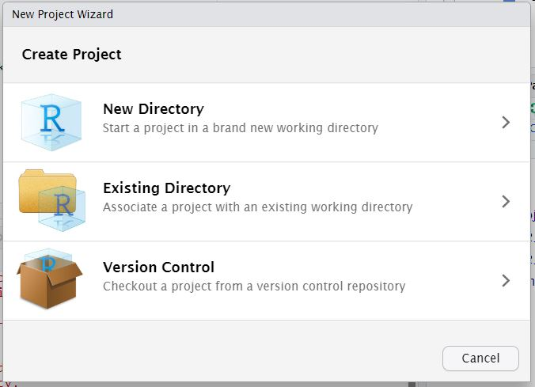

```{r setup, include = FALSE}
knitr::opts_chunk$set(message = FALSE, warning = FALSE)
```

## This Session

In this section, we'll start by introducing projects in R and why you should use them. Then we'll move on to plotting:

- Introducing `{ggplot2}`
- Basic plot types
- Adding Layers
- Themes and Styling
- Combining plots using `{patchwork}`

---

class: center, middle, inverse

# Projects

---

## Why use projects?

When reading in data previously we have specified the full file path to the file that we want to read in. These are *absolute* file paths.

If we have an information request folder where we have some R scripts and some data that we are using to complete the request and someone decides to rename the main folder, or move the folder somewhere else, that means we would have to edit every script where files are read in or saved out to ensure we are picking up the right file.

Projects overcome this by setting a *relative* path. The working directory is set to whatever folder the project file is saved in - so folders above the project can be renamed or moved without affecting your script.

Using projects also allows you to use github for version control and collaboration - which we'll come to in due course!

---

## Starting a new project

To start a new project click on the symbol that looks like the letter `R` in a box that is in the second row of the menu bar and second from the left. This will open a window:



---

## Starting a new project

If you haven't got a folder set up to save your analysis in select the first option "New Directory". This will let you create a new folder.

If you have already set up a folder to work from and want to associate it with a project select "Existing Directory". this will allow you to navigate to the relevant folder.

If you are taking a project from github select the third option "Version Control". This will ask you to link to the repository and create a folder to save your analysis in.

---

## Opening an existing project

There are many ways to open an existing project in RStudio and all of these are available in Posit, however some methods of opening projects are more robust in Posit than others. 

[The recommended way of opening projects in Posit](https://public-health-scotland.github.io/knowledge-base/docs/Posit%20Infrastructure?doc=FAQs.md#projects) is:

1. Open a small session with 0.2 CPUs and 200MB memory

2. Click the "New Session" button in the top left of the interface (be careful it's right next to the quit button!)

3. In the window that opens select the "Project" tab and navigate to the project file

4. Input memory requirements and then click open session

---

class: center, middle, inverse2

# `{ggplot2}`

---

## The Grammar of Graphics

---

## Geometries

---

## Aesthetics

---

class: center, middle, inverse3

# Customising your plots

---

## Themes

---

## Customising themes

---
class: center, middle, inverse4

# Combining plots

---

## Simple layouts

---

## Custom layouts

