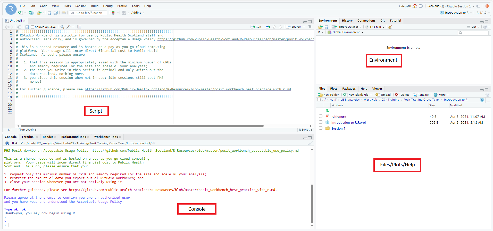

```{r setup, include = FALSE}
knitr::opts_chunk$set(message = FALSE, warning = FALSE)
```

## This Session

In this session we will focus on getting started on data analysis using Posit Workbench. By the end of this session, you will have the knowledge to:

- Open Posit Workbench & open a blank R script
- Read a data set into R
- Produce simple data summaries
- Manipulate data sets: transform columns and produce grouped summaries
- Merge data sets

---

class: center, middle

# R, RStudio and Posit

---

## Why R?

R is a programming language designed around statistical analysis. 

--

### Advantages:

- Shareable
- Flexible
- Open Source
- Massive community

--

### Disadvantages:

- Programming is hard

---

## RStudio and Posit

R is what does the heavy lifting - think of it as the engine.

RStudio/Posit are the wrappers that allow us to interact with R - like the controls of a car. There are a variety of ways to use R through Posit, and general code will work in exactly the same way across all of these, though there may be changes to how files are accessed.

- RStudio Desktop - an application downloaded and running on your own machine

- Posit Cloud (formerly RStudio Cloud) - A cloud based service that runs within your browser

- Posit Workbench - A server based version which is typically used by organisations

RStudio and Posit are one and the same, in that Posit used to be called RStudio. At PHS we use [Posit workbench](https://pwb.publichealthscotland.org/auth-sign-in).

---

## Programming

Since R is a programming language, it's important to think about tasks from a programming perspective.

The key in this is breaking tasks down into small chunks of what needs to be done. 

Since you are familiar with doing analysis in other software (and to ease you in) we'll start by completing the tasks set out in Excel.

While you are doing this, make a note of the steps you are carrying out while you are doing the analysis.

---

class: center, middle

# Terminology

---

## Getting Started with Posit

To log into Posit Workbench, visit https://pwb.publichealthscotland.org/auth-sign-in and log in with the same credentials you use to log in to your laptop.

Once you have signed in, you will need to set up a session by clicking the New Session button:

```{r, echo=FALSE, out.width="75%", fig.align="center"}

```

Then select an appropriate number of CPUs and Memory - the default is usually fine unless your are dealing with large amounts of data!

---

## Getting Around the Posit Session

When your session starts there will usually be three panes - one on the left and two on the right:

```{r, echo=FALSE, out.width="75%", fig.align="center"}

```


You need to first acknowledge the [Acceptable Usage Policy](https://github.com/Public-Health-Scotland/R-Resources/blob/master/posit_workbench_acceptable_use_policy.md) by typing in the pane on the left (the console).


Before starting any work in R, you will need to open a script by going to *File > New File > R Script*. Using a script allows you to save your work. 
---

## The Four Panes

```{r, echo=FALSE, out.width="90%", fig.align="center"}

```

---

## The Four Panes

**The script** is where you will do most of your work. This is where you should type your code, and this is what you should be saving as you go along. 

--

**The console** is where a lot of your output will appear from numerical calculations. You wouldn't typically do a lot of coding in here but it can be used for small calculations that you aren't that bothered about saving.

--

**The environment** contains all of the possible objects that you have available to use in your R session. If you create an object then it will appear as a name in this pane.

--

**The Files/Plots/Help pane** contains a variety of different things. Using the file tab, you can browse through available files and folders. When you start producing plots, these will appear in this pane. Help files can be viewed here under the Help tab - these will help you to use different aspects of R programming.
---

## From Excel to R

In Excel, you work with tables of data where each row of the table relates to an observation and each column relates to a variable within the data set. Multiple tables might be stored across multiple sheets

--

In R it is exactly the same, though we refer to the tables as *data frames* or *tibbles*, and multiple data frames can be stored in the environment.

--

When using Excel, you navigate to a file, click to open the file and then you manipulate the table using formulas and by point-and-click processes. It is then difficult to share the steps of the analysis with other people.

--

In R you specify a file path, and tell R how to open that file. Then you use commands (*functions*) to work with the data which can be saved as a record of the analysis performed.

---

## Opening Data in R

In R we need to be specific about where the file is stored on a computer, and then how to read the information depending on the type of file.

For the first part we specify the file path. For today's session the file path will be *`r stringr::str_replace(getwd(), "Slides", "Data")`*.

For the second part we need to use a function which matches the file type. 

---

## Packages

R is open source, and is also community contributed. This means that it has vast functionality, but also means that to load (or even hold) every single possible function that has ever been written would be impossible.

Packages hold sets of related functions that individual users can use as needed. By default R is downloaded and opens with a small set of core packages containing the most fundamental functionality to R. 

Anything over and above these core packaged will need to be installed by the user. The easiest way to do this is to use the `install.packages()` function (*You only need to install a package once*): 

```{r eval = FALSE}
# Replace packagename with the name of the package that you want to install
install.packages("packagename") 
```

Once you have installed a package, if you want to use functions within this package you will need to load the package: 
```{r eval = FALSE}
library(packagename)
```
Once you have done this you will be able to use the functionality within that package for your current R session.
---

## Functions

Functions are a fundamental part of programming in R. Everything that you do in R will use a function (even if you are not aware that it is using a function).

Functions will take the form `functionname(args)` and will usually be represented in text as `functionname()`.

Each function will take some arguments within the brackets which specify parameters that the function needs to run. You can view the available arguments for any function in packages that you have loaded:

```{r eval=FALSE}
?functionname
```

This will open a page in the Help pane showing the help file for the function requested.

If you haven't loaded the package, or just want to search all help files for all installed pages for a key word:

```{r eval = FALSE}
??keyword
```

Will produce a set of search results. (Note depending on the number or type of packages installed this can take a while!)

---
## Reading in an Example Data Set

Functions for reading in data usually have the form `read_filetype()` (e.g. `read_csv()` would read in a .csv file, and `read_xlsx()` would read in a .xslx file). 

These functions usually come from non-default packages: `read_csv()` comes from the `readr` package and `read_xlsx()` comes from the `readxl` package.

To read in data on HSCP populations we would use:


```{r}
# Load package for reading in data
library(readr)

# Read in the data: <- assigns a name to your data frame so that you can
# refer to it in code.
populations <- read_csv("/conf/linkage/output/lookups/Unicode/Populations/Estimates/HSCP2019_pop_est_1981_2022.csv")
```

---

## Using Data Frames

Once we have our data named in R we may want to look at specific elements of the data.

To do this we can use *square bracket notation*:

```{r, eval = FALSE}
my_data[i, j]
```

would return the value in the `i`th row and `j`th column. We can similarly extract whole rows or whole columns:

```{r, eval = FALSE}
my_data[i, ] # ith row

my_data[ ,j] # jth column
```

These work with numeric values, but we may want to extract a column based on its name. We can do this using square bracket notation, or we can use *dollar notation* which is more common:

```{r, eval = FALSE}
my_data[ , "col"] # square bracket notation

my_data$col # dollar notation
```

---

## Useful Functions for Data Frames

These functions are build into the default packages in R and take a data frame as their argument.

- `head()`, `tail()`: Prints the first or last few rows of the data frame to the console

- `View()`: Opens data frame in a tab which allows you to view the data in a table

- `str()`: Displays the structure of a data frame including column types

- `names()`: Extracts the column names associated with a data frame

- `summary()`: Produces column-wise summaries of the data

---

## Example: HSCP Populations

```{r}
head(populations)

tail(populations)

```

---

## Example: HSCP Populations

```{r}
summary(populations)
```

---

## Vectors

Vectors in R represent a collection of related values of the same type (i.e. all numbers, all text, all dates etc.). For example when you use `names()` to get the names of columns in a data frame this is a vector. More importantly, when you extract a *column* of a data frame this is a vector.

This is important because a lot of functions in R are vectorised - that is they work with vector inputs. 

It is this which allows us to transform columns of data by multiplying, adding, subtracting dividing. This allows us to calculate column summaries.

If you need to create a new vector you can use the function `c()`, or there are special functions `rep()` and `seq()` for vectors which have repeating patterns and sequences. The following can all be used to create the vector 1, 2, 3, 1, 2, 3

```{r}
x <- c(1, 2, 3, 1, 2, 3)

x <- c(1:3, 1:3, 1:3) # : is shorthand for a sequence increasing by 1

x <- c(seq(1, 3, by = 1), seq(1, 3, by = 1), seq(1, 3, by = 1))

x <- rep(seq(1, 3, by = 1), times = 3)
```

---

## Vector Types

As with data types, there are different types of vector. The most common types are:

- `Numeric`: Numbers. There is a class of vector `integer` for whole numbers, and `double` for decimal numbers. Integers are represented with `L` afterwards (e.g. `1L`, `2L`, `3L`). 

- `Character`: Any text values, usually representing categorical data. Values are surrounded by quotation marks `""` or `''`

- `Logical`: A binary value that takes the value `TRUE` or `FALSE`. These are usually generated using logical statements.

There are also types to deal with date objects. 

In some cases you may need to convert between types. You can use `as.type(x)` replacing `type` with the target vector type, so transforming `x` into a character vector would be:

```{r, echo = TRUE}
as.character(x) # you can see it's character because it has quotations around each value 
```

---

## Logical Statements

A logical statement is one which will return logical vectors (`TRUE`/`FALSE`). These will generally be comparisons:

- equal to - `==`

- less than, greater than, less than or equal to, greater than or equal to: `<`, `>`, `<=` `>=`

- not - `!` usually put at the front of the statement (not equal to becomes `!=`)

- logical and, logical or - `&`, `|`

There are some functions which act as comparisons, such as functions to test whether an object is of a particular type (e.g. `is.numeric()`, `is.character()`)

---

## Useful Functions for Vectors

Some useful summary functions for vectors:

- `mean()`, `median()`, `sd()`, `var()` - calculates the mean/median/standard deviation/variance of a numeric vector

- `paste()`, `paste0()` - combines character vectors, `paste()` allows you to specify a separator, `paste0()` does not

- `is.type()` (replacing `type` with relevant vector type) - allows you to test whether a vector is of a specified type

- `is.na()`, `is.infinite()` - allows you to test whether elements of a vector are missing (`NA`), or infinite (`Inf`/`-Inf`) 

- `sum()`, `cumsum()` - produces the sum or cumulative sum of a numeric vector

- `unique()` - provides the unique values within a vector

---

## Example: HSCP Populations

```{r}
mean(populations$pop)

unique(populations$year)

unique(populations$sex_name)

is.numeric(populations$age)

```
---

## Example: HSCP Populations

You can treat logical values as numeric, which means that you can easily find the number of values meeting a condition (`sum()`), or the proportion of values meeting a condition (`mean()`)

```{r}
sum(populations$year==2022)

mean(populations$pop > 1000)
```

---

class: center, middle

# Manipulating Data

---

## The Tidyverse

The Tidyverse is a suite of packages that make manipulating, summarising and transforming various types of data by placing it into a consistent "grammar" of code that almost follows English. 

One of the ways it does that is using the pipe operator, which you may see written as either `|>` or `%>%`. This sets a flow of code with the result of one line of code being passed into the first argument of the next function.

The next two sections will focus on the package `dplyr` which provides different options for subsetting, summarising and transforming variables. 

To demonstrate these functions generally, we'll use the mid year population estimates. Starting individually, then we will build into a single, readable pipeline.

---

## HSCP Populations Data

We are still using the HSCP Populations Data, and we need to load the `dplyr` package.

```{r}
library(dplyr)

head(populations)
```
---

## Subsetting Rows: `filter()`

We want to keep memory usage at a minimum, in order to minimise our use of Posit resources, and also to make our code as efficient as possible. One way that we can do that is by *filtering* out the rows that we are interested in to carry out our analysis. 

Since the data goes back to 1981, we may want to filter out only the most recent data:

```{r}
populations_filtered <- populations %>% 
  filter(year == 2022)

head(populations_filtered)
```
---

## Subsetting Columns: `select()`

As with filtering rows, we may also want to *select* out only the specific columns that we want to use. 

The function for this is `select()` which can be used in a variety of ways. In particular, the column `year` contains no information since we filtered only the most recent year, the columns `sex` and `sex_name` contain the same information, so we might also consider removing one of these

**Selecting using column names (directly)**

We can simply specify column names within `select()` to specify which columns we would like to select. We can use `:` so select columns within a range. We can either specify the columns that we want to keep, or remove the columns that we don't want to keep using `!`. 

```{r}
populations_selected <- populations_filtered %>% 
  select(hscp2019:age, sex_name:pop)

populations_selected <- populations_filtered %>% 
  select(!c(year, sex))
```
---
## Subsetting Columns: `select()`

**Select using column names (indirectly)**

We might want to select out columns based on properties of their names. That is select columns whose name *starts with*, *ends with* or *contains* particular values (corresponding to that functions `starts_with()`, `ends_with()`, and `contains()` respectively). If we wanted only the HSCP information from this data set:

```{r eval = FALSE}
populations_filtered %>% 
  select(starts_with("hscp"))
```

**Select based on values within column**

We might be interested in extracting columns *where* a particular condition is met based on their values. For example only extract columns which contain numbers:

```{r eval = FALSE}
populations_filtered %>% 
  select(where(is.numeric))
```

---

## Summarising Data: `summarise()`

We may be interested in *summarising* our data in some capacity. For example we could calculate the total population overall:

```{r eval = FALSE}
populations_selected %>% 
  summarise(total_pop = sum(pop))
```

More likely we would want to *group by* some variable(s) first to calculate grouped summaries. To calculate the total population in each age group within each HSCP:

```{r}
populations_summarised_group <- populations_selected %>% 
  # hscps are the same grouping, but we want to keep both columns
  group_by(hscp2019, hscp2019name, age) %>% 
  summarise(pop = sum(pop))
```
---

## A note on `group_by()`

The `group_by()` function creates useful groupings in out data, but we need to be a little careful when we use it. In the previous example we used `group_by()` to find the population within each age. when we look at our new data frame, it still maintains a grouping structure:

```{r, highlight.output=2}
populations_summarised_group
```


Each time you summarise, the last level of the grouping structure will be removed - to our data frame is no longer grouped by `age` in this case.

---

## Removing grouping structure: `ungroup()`

We might want to retain this grouping structure, in which case we don't want to do anything. If we don't want to use this grouping going forward we would need to *ungroup* our data:

```{r}
populations_summarised_ungroup <- populations_selected %>% 
  # hscps are the same grouping, but we want to keep both columns
  group_by(hscp2019, hscp2019name, age) %>% 
  summarise(pop = sum(pop)) %>% 
  # It is good practice to remove groupings unless you require them for a future step
  ungroup()

populations_summarised_ungroup
```

---
## Transforming Data: `mutate()`

We may also need to transform a column or create a new column, for example calculating a proportion or a rate. In our populations example let's say we want to calculate the proportion of the total population in each of the groups in the summarised populations data.

```{r}
# Here it doesn't matter whether I use the ungrouped or grouped data
denom <- sum(populations_summarised_ungroup$pop)

populations_mutate <- populations_summarised_group %>% 
  mutate(prop = pop/denom)
```

--

We can do the calculation within `mutate()`, but we need to be careful about grouping:

```{r}
# This produces the proportion of the total population as before
populations_mutate_ungroup <- populations_summarised_ungroup %>% 
  mutate(prop = pop/sum(pop))

# This produces the proportion of the population within each HSCP due to the remaining groupings
populations_mutate_group <- populations_summarised_group %>% 
  mutate(prop = pop/sum(pop))
```

---

## Creating a Pipeline

Putting that whole analysis into one pipeline can help to make it clear what the process you are following is. So here, the goal is to get the proportion of the population of an area which falls into a specific age group. 

```{r}
pops_by_age <- populations %>% 
  # filter out appropriate year
  filter(year == 2022) %>% 
  # select columns
  select(!c(year, sex)) %>% 
  # group by hscp and age for summary
  group_by(hscp2019, hscp2019name, age) %>% 
  # sum to find the total population
  summarise(pop = sum(pop)) %>% 
  # Create new column containing population divided by total population
  mutate(prop = pop/sum(pop))

```
---

class: center, middle

# Merging data

---

## Binding Rows: `bind_rows()`

We may have two (or more) data sets containing the same information that we want to stack on top of one another to create a bigger data set. In R we want to bind the rows. A typical use for row binding is where we have information that is separated by groups, and we want to add total information.

In our population example, we might want to produce a data frame that has information on the population for males, females and overall. We first create the data set that contains the total summaries:

```{r}
pops_by_age <- populations %>% 
  # filter out appropriate year
  filter(year == 2022) %>% 
  # select columns
  select(!c(year, sex)) %>% 
  # group by hscp and age for summary
  group_by(hscp2019, hscp2019name, age) %>% 
  # sum to find the total population
  summarise(pop = sum(pop)) %>% 
  # add column for sex
  mutate(sex_name = "All")
```

---

## Binding rows: `bind_rows()`

Then we need to extract the relevant data from the original data set before combining: 

```{r}
pops <- populations %>% 
  # filter out appropriate year
  filter(year==2022) %>% 
  # Select columns for compatibility
  select(!c(year, sex, hscp2018:hscp2016)) %>%
  # bind rows
  bind_rows(pops_by_age) %>%
  # Sort data so we can see the result
  arrange(hscp2019name, age)

pops
```
---

## Merging Columns (Joins)

You may find yourself in a situation where you are pulling different pieces of data from multiple sources, that you need to combine. When combining column wise you would use a join which will match observations based on some key. 

The joins available in R are the same as SQL joins:

- Left join: `left_join(df1, df2)` joins the two data sets and keeps all observations in `df1` regardless of whether there is a match in `df2`

- Right join: `right_join(df1, df2)` joins the two data sets and keeps all observations in `df2` regardless of whether there is a match in `df1`

- Full join: `full_join(df1, df2)` joins the two data sets and keeps all observations in both data sets

- Inner join: `inner_join(df1, df2)` joins the two data sets and keeps only observations which have a match in both data sets

---

## Filtering Joins

In some cases you may be interested in filtering a data set without joining. To do this you can use filtering joins:

- `semi_join(df1, df2)` - returns all rows in `df1` where there is a match in `df2`

- `anti_join(df1, df2)` - returns all rows in `df1` where there is not a match in `df2`

